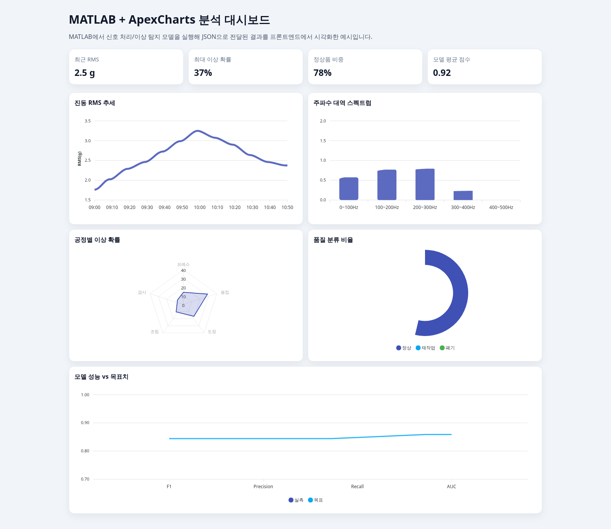

# MATLAB 분석 대시보드 (ApexCharts)

MATLAB에서 생성한 분석 결과(신호 처리, 이상 탐지, 품질 지표)를 JSON 형태로 전달받아 ApexCharts로 시각화하는 Vite 기반 프론트엔드 예시입니다.



## 포함된 시각화 예시

- 진동 RMS 시계열 추세 (Line)
- 주파수 대역 스펙트럼 (Bar)
- 공정별 이상 확률 (Radar)
- 품질 분류 비율 (Donut)
- 모델 성능 vs 목표치 (Mixed: Column + Line)

## MATLAB 연동 아이디어

실무에서는 아래 흐름으로 연동할 수 있습니다.

1. MATLAB 스크립트/함수에서 분석 실행
2. 결과를 JSON으로 직렬화 (`jsonencode`)
3. API 또는 파일로 프론트엔드에 전달
4. 프론트엔드에서 ApexCharts 시리즈 데이터로 매핑

예시 MATLAB 코드:

```matlab
result.timestamp = ["09:00","09:10","09:20"];
result.vibrationRms = [1.8,2.1,2.4];
jsonText = jsonencode(result);
```

## 로컬 개발

```bash
npm install
npm run dev
```

## 프로덕션 빌드

```bash
npm run build
npm run preview
```
